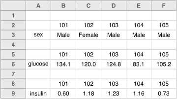
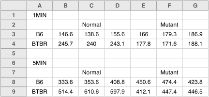

The best layout for your data within in a spreadsheet is as a big
rectangle with rows corresponding to the subjects and columns
corresponding to variables. The first row should contain variable
names. (*Please don't use more than one row for the variable names.*)
Here's an example:

 

Some data sets won't fit nicely into a rectangle, but they'll usually
fit into a set of rectangles, in which you can make a set of Excel files,
each with a rectangle of data. Some data don't even fit into a set of
rectangles, but then maybe spreadsheets are not the best format for
them, as spreadsheets seem inherently rectangular.

The data files that I receive are not very often in rectangular
form. More often, there seem to be bits of data sprinkled about.
Like this:

 

Or maybe like this:

 

---

Next up: [Create a data dictionary](dictionary.html).
