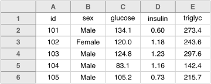
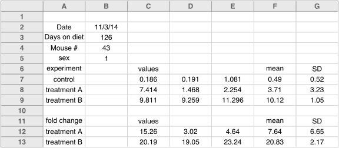
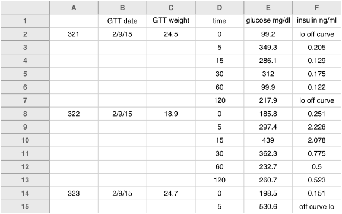
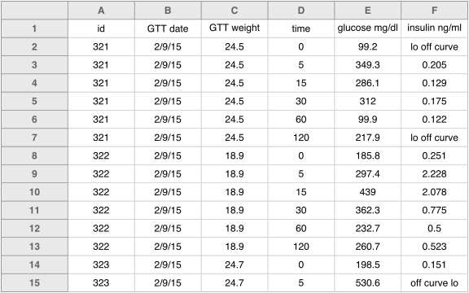
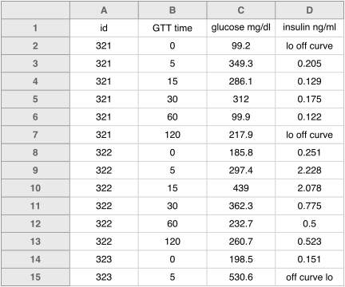
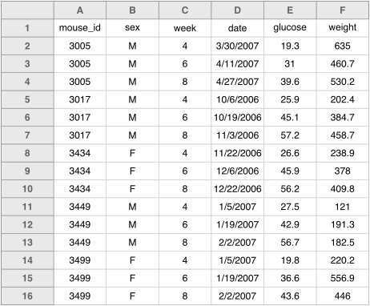

The best layout for your data within in a spreadsheet is as a big
rectangle with rows corresponding to subjects and columns
corresponding to variables. The first row should contain variable
names. (*Please don't use more than one row for the variable names.*)
Here's an example:

 

Some data sets won't fit nicely into a rectangle, but they'll usually
fit into a set of rectangles, in which you can make a set of Excel files,
each with a rectangle of data. Some data don't even fit into a set of
rectangles, but then maybe spreadsheets are not the best format for
them, as spreadsheets seem inherently rectangular.

The data files that I receive are not very often in rectangular
form. More often, there seem to be bits of data sprinkled about.
Like this:

 

Or maybe like this:

 

In both of these cases, the data analyst has to study the layout, figure out
what everything means, and then spend some time rearranging things.

Another recent example: a separate worksheet for each subject, each in
a complicated format like this:

 

If all of the worksheets have exactly the same layout, then it's not
too hard to pull out the relevant information and combine it into a
rectangle. (I'd write a [python](https://www.python.org) or
[ruby](https://www.ruby-lang.org) script.) But I prefer to not have
means and SDs and fold change calculations cluttering things up, and
it seems that even for data entry, it'd be easier to have all of the
measurements on one worksheet.

Sometimes it's hard to see how to reorganize things as a
rectangle. Consider this example:

 

Well, it's sort of a rectangle; we could just fill in the empty cells,
like this:

 

But it seems wrong to repeat the weights like that. It's better to
make two separate tables, one with the weights, and one with these
other measurements (which are for in vivo assay, the glucose tolerance
test: give a mouse some glucose and measure serum glucose and insulin
levels at different times afterwards).

So you'd have one table with the weights, like this:

 

And then another rectangle with the GTT results, like this:

 

This is an example of what's called "tidy" data (see [the paper](http://www.jstatsoft.org/v59/i10/paper) by
[Hadley Wickham](http://had.co.nz/)): each row is an experimental
unit, which is usually just a subject but in this case is a single
assay measurement on a subject. Reorganizing the data into a "tidy"
format can simplify later analysis. But the rectangular aspect is the
most important part.

Another issue I see is the use of two rows of header names, often with
blank cells or merged cells, like this:

 

I'd prefer to have the week information within the variable name, like
this:

 

Even better would be to make it a "tidy" data set
with each row being a subject on a
particular day, like this:

 

**Make it a rectangle!** (Or, if necessary, make it a set of
  rectangles, but that doesn't have quite the same punch.)

---

Next up: [Create a data dictionary](dictionary.html).

(Previous: [Put just one thing in a cell](one_thing_per_cell.html).)
